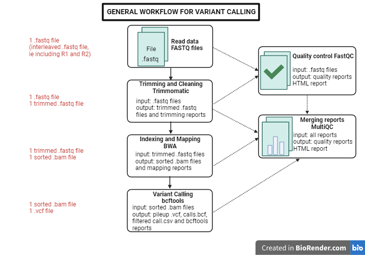

# Variant calling

## Table of content
1. [Description](#descrp)
2. [Requirements](#req)
3. [Usage](#usage)
4. [Authors](#authors)
5. [References](#references)

<a name="descrp"></a>

## Description
The goal of this project is to implement a small variant calling pipeline using .fastq files from Illumina sequencing device.

#### The pipeline is designed as follow:



<a name="req"></a> 

## Requirements

#### Install miniconda3: 

[Miniconda](https://docs.conda.io/en/latest/miniconda.html#linux-installers)

#### Install Miniforge3 for Linux:

[Miniforge3](https://github.com/conda-forge/miniforge?tab=readme-ov-file)

Then, close and re-open your terminal window and run ```which mamba``` to see if mamba is well installed.

#### Install your environment from a .yml file:

[Environment](https://conda.io/projects/conda/en/latest/user-guide/tasks/manage-environments.html#activating-an-environment)

Run ```conda activate myenv.yml``` to install the environment.

<a name="usage"></a> 

## Usage

<a name="authors"></a> 

## Author
This project is developed by Chloé Aujoulat.

<a name="references"></a> 

## References

https://bioinfo.cd-genomics.com/quality-control-how-do-you-read-your-fastqc-results.html 
